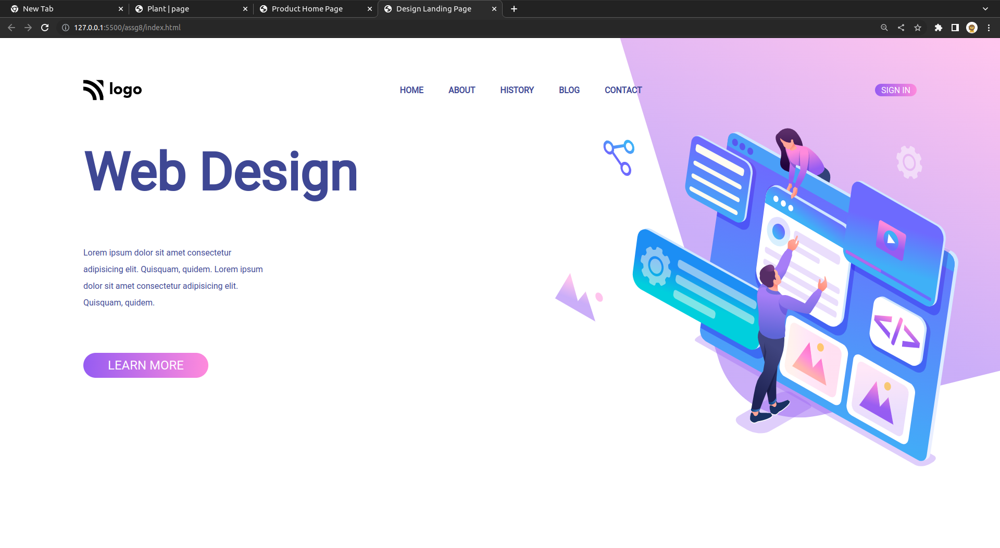

# Web-Design | Page - HTML & CSS!

By Prince Kr Paswan

## [Link to the Web-Design (project-8)](https://web-page1.netlify.app/)

## What I learned While creating this page?

- Learned about gradent color.
- Learnd to use css position  property.
- I learned how to add custom fonts.
- I learned about image positioning and image hight.

## This project took around 3 hours to complete.
